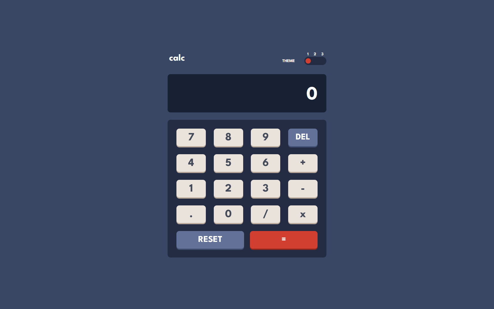

# Frontend Mentor - Calculator app solution

This is a solution to the [Calculator app challenge on Frontend Mentor](https://www.frontendmentor.io/challenges/calculator-app-9lteq5N29). 
## Table of contents

- [Overview](#overview)
  - [The challenge](#the-challenge)
  - [Screenshot](#screenshot)
  - [Links](#links)
- [My process](#my-process)
  - [Built with](#built-with)
  - [What I learned](#what-i-learned)
  - [Useful resources](#useful-resources)

## Overview

### The challenge

The user is able to:

- See the size of the elements adjust based on their device's screen size
- Perform mathmatical operations like addition, subtraction, multiplication, and division
- Adjust the color theme based on their preference

### Screenshot

### Links

- Solution URL: [github repo](https://github.com/Lequral/Calculator)
- Live Site URL: [github live page]()

## My process

### Built with

- HTML5
- SASS
- [Typescript's page](https://www.typescriptlang.org/) - Typescript
- [Svelte's page](https://svelte.dev/) - Svelte framework

### What I learned

I'm happy to finally finish this project. It was a way a for me to get into typescript, sass and especially svelte. I think choosing a framework was a big step in my web developpement journey, it facilitated a lot of the process, for example, making the screen update when you enter numbers etc... Now one thing I'm not happy with is how I got the themes to change. I tried multiple ways, having 3 scss files for each color theme but i couldn't find a way to globally change the color theme's file import on components. 

### Useful resources

- [Svelte tutorials](https://svelte.dev/tutorial/basics) - This helped me to learn svelte.
- [Beginner's Guide to Using SCSS](https://www.code-boost.com/beginners-guide-to-scss/#mixins) - This is an nice article which helped me learn scss quickly.
- [Typescript Documentation](https://www.typescriptlang.org/docs/handbook/2/basic-types.html) - This article summarized me the features of typescript.